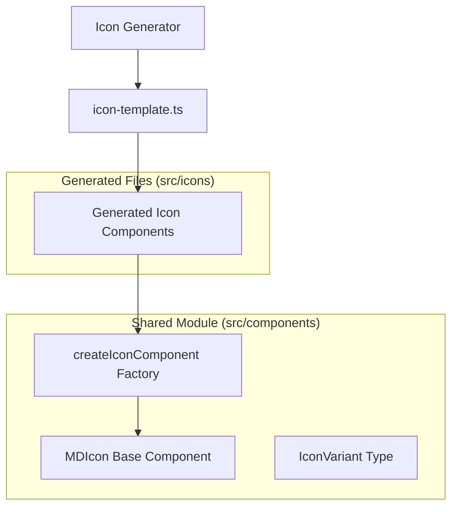

# Design Document

## Overview

本设计描述了图标代码生成器的重构方案。核心思路是将图标组件的公共逻辑提取到一个工厂函数 `createIconComponent` 中，每个生成的图标组件只需调用该工厂函数并传入图标特有的数据（名称和 SVG 映射）。

### 当前问题

每个生成的图标组件约 60-80 行代码，其中：
- ~10 行：import 和类型定义（重复）
- ~10 行：props 定义（重复）
- ~20 行：setup 逻辑（重复）
- ~30-40 行：SVG 内容（唯一差异）

### 重构目标

将重复代码提取后，每个图标组件将减少到约 15-25 行（主要是 SVG 内容）。

## Architecture



## Components and Interfaces

### 1. Icon Factory Function

```typescript
// src/components/createIconComponent.ts

import { defineComponent, type PropType, type VNode } from 'vue'
import { MDIcon } from './MDIcon'

export type IconVariant = 'filled' | 'outlined' | 'round' | 'sharp' | 'twotone'

export type SvgMap = Partial<Record<IconVariant, () => VNode>>

export interface IconDefinition {
  name: string           // 组件名称，如 'MDIAccessibility'
  iconName: string       // 图标名称，用于 CSS 类名，如 'accessibility'
  svgMap: SvgMap         // SVG 内容映射
}

/**
 * 创建图标组件的工厂函数
 */
export function createIconComponent(definition: IconDefinition) {
  const { name, iconName, svgMap } = definition
  const availableVariants = Object.keys(svgMap) as IconVariant[]
  const defaultVariant = availableVariants.includes('filled') ? 'filled' : availableVariants[0]
  const baseClassName = `mdi-${iconName}`

  return defineComponent({
    name,
    props: {
      variant: {
        type: String as PropType<IconVariant>,
        default: defaultVariant,
      },
    },
    setup(props) {
      return () => {
        const requestedVariant = props.variant
        const variant = availableVariants.includes(requestedVariant)
          ? requestedVariant
          : defaultVariant

        const className = variant === 'filled'
          ? baseClassName
          : `${baseClassName}-${variant}`

        const renderSvg = svgMap[variant]

        return (
          <MDIcon class={className}>
            {renderSvg ? renderSvg() : null}
          </MDIcon>
        )
      }
    },
  })
}
```

### 2. Generated Icon Component (New Format)

```typescript
// src/icons/action/MdiAccessibility.tsx (重构后)

import { createIconComponent } from '../../components/createIconComponent'

export const MDIAccessibility = createIconComponent({
  name: 'MDIAccessibility',
  iconName: 'accessibility',
  svgMap: {
    filled: () => (
      <svg height="1em" viewBox="0 0 24 24" width="1em" fill="currentColor">
        <path d="M0 0h24v24H0z" fill="none" />
        <path d="M12 2c1.1 0 2 .9 2 2s-.9 2-2 2-2-.9-2-2 .9-2 2-2zm9 7h-6v13h-2v-6h-2v6H9V9H3V7h18v2z" />
      </svg>
    ),
    outlined: () => (/* SVG content */),
    round: () => (/* SVG content */),
    sharp: () => (/* SVG content */),
    twotone: () => (/* SVG content */),
  },
})
```

### 3. Updated Icon Template

```typescript
// scripts/templates/icon-template.ts (重构后)

export function iconTemplate(
  svgContents: Partial<Record<IconVariant, string>>,
  iconName: string,
  componentName: string,
): string {
  const variants = Object.keys(svgContents) as IconVariant[]

  const svgMapEntries = variants
    .map((variant) => {
      const svg = svgContents[variant]
      return `    ${variant}: () => (${svg})`
    })
    .join(',\n')

  return `import { createIconComponent } from '../../components/createIconComponent'

export const ${componentName} = createIconComponent({
  name: '${componentName}',
  iconName: '${iconName}',
  svgMap: {
${svgMapEntries}
  },
})
`
}
```

## Data Models

### IconDefinition Interface

| Field | Type | Description |
|-------|------|-------------|
| name | string | Vue 组件名称（如 'MDIAccessibility'） |
| iconName | string | 图标名称，用于生成 CSS 类名（如 'accessibility'） |
| svgMap | SvgMap | 各变体对应的 SVG 渲染函数映射 |

### SvgMap Type

```typescript
type SvgMap = Partial<Record<IconVariant, () => VNode>>
```

键为变体类型，值为返回 VNode 的函数（延迟渲染以优化性能）。


## Correctness Properties

*A property is a characteristic or behavior that should hold true across all valid executions of a system-essentially, a formal statement about what the system should do. Properties serve as the bridge between human-readable specifications and machine-verifiable correctness guarantees.*

### Property 1: Generated files use shared imports without duplicated logic

*For any* generated icon component file, the file SHALL contain an import from `createIconComponent` AND SHALL NOT contain inline `defineComponent`, `props` definition, or `setup` function.

**Validates: Requirements 1.1, 3.2**

### Property 2: Generated files contain only minimal icon-specific data

*For any* generated icon component file, the file SHALL contain exactly three icon-specific fields: `name`, `iconName`, and `svgMap`, with no additional component logic.

**Validates: Requirements 1.2, 3.1**

### Property 3: Render output equivalence

*For any* icon component and any variant, rendering the refactored component SHALL produce the same DOM structure (MDIcon wrapper, CSS class, SVG content) as the original implementation.

**Validates: Requirements 1.4, 4.3**

### Property 4: Valid variant selection

*For any* icon component with a given svgMap, when a variant that exists in the svgMap is requested, the component SHALL render that variant's SVG content.

**Validates: Requirements 2.1**

### Property 5: Invalid variant fallback

*For any* icon component with a given svgMap, when a variant that does NOT exist in the svgMap is requested, the component SHALL fall back to the default variant (filled if available, otherwise the first available variant).

**Validates: Requirements 2.2**

### Property 6: CSS class name pattern

*For any* icon with name `iconName` and variant `v`, the generated CSS class SHALL be `mdi-{iconName}` when `v` is 'filled', and `mdi-{iconName}-{v}` otherwise.

**Validates: Requirements 2.3**

### Property 7: Export name consistency

*For any* generated icon component, the exported component name SHALL match the pattern `MDI{PascalCaseName}` and be consistent with the original naming convention.

**Validates: Requirements 4.1**

### Property 8: Generated file line count

*For any* generated icon component file, the non-SVG boilerplate code SHALL be fewer than 15 lines (import + createIconComponent call structure).

**Validates: Requirements 5.2**

## Error Handling

### Generator Errors

| Error Condition | Handling Strategy |
|-----------------|-------------------|
| Missing SVG file | Log warning, skip variant, continue with available variants |
| Empty SVG content | Log warning, skip variant |
| No valid variants | Log error, skip icon entirely |
| Invalid icon name | Normalize name using existing `getClassName` function |

### Runtime Errors

| Error Condition | Handling Strategy |
|-----------------|-------------------|
| Invalid variant prop | Fall back to default variant (no error thrown) |
| Missing svgMap entry | Render null content (graceful degradation) |

## Testing Strategy

### 测试命令

```bash
# 运行所有单元测试和属性测试
pnpm test:unit

# 运行端到端测试
pnpm test:e2e

# 生成图标组件
pnpm gulp:icon
```

### Property-Based Testing

使用 `fast-check` 库进行属性测试。每个属性测试运行至少 100 次迭代。

#### Test Structure

```typescript
// tests/icon-generator.property.test.ts

import fc from 'fast-check'
import { describe, it, expect } from 'vitest'

describe('Icon Generator Properties', () => {
  // Property tests will be implemented here
})
```

#### Property Test Annotations

每个属性测试必须使用以下格式标注：
```typescript
/**
 * **Feature: icon-generator-refactor, Property 1: Generated files use shared imports**
 * **Validates: Requirements 1.1, 3.2**
 */
it('should use shared imports without duplicated logic', () => {
  // test implementation
})
```

### Unit Testing

单元测试覆盖以下场景：

1. `createIconComponent` 工厂函数
   - 正确创建 Vue 组件
   - 正确处理 props
   - 正确生成 CSS 类名

2. Icon Template 生成
   - 生成正确的 import 语句
   - 生成正确的 svgMap 结构
   - 处理特殊字符的图标名称

3. 向后兼容性
   - 导出名称一致
   - Props 类型兼容
   - 渲染输出一致

### Integration Testing

1. 生成完整的图标集并验证：
   - 所有文件可以被 TypeScript 编译
   - 所有组件可以被正确导入
   - 总代码量减少 50% 以上
