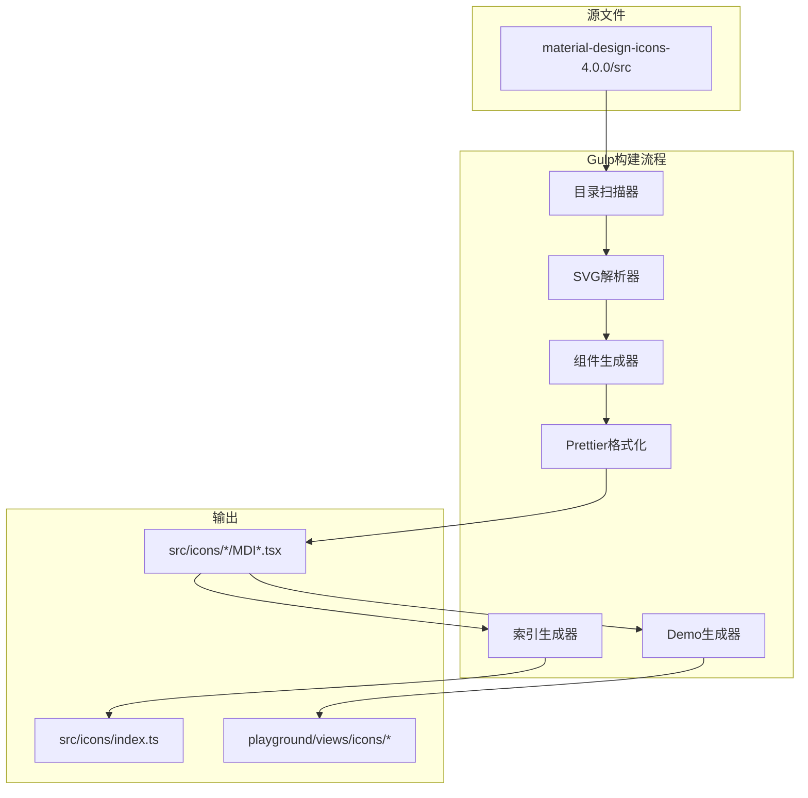

# 设计文档

## 概述

本设计文档描述了将 Material Design Icons Vue 组件库从 3.0 版本升级到 4.0 版本的技术实现方案。主要变化包括：

1. 从本地 `material-design-icons-4.0.0/src` 目录读取 SVG 文件，替代 npm 包
2. 支持 5 种图标变体（filled、outlined、round、sharp、twotone）
3. 生成统一的 Vue 组件，通过 `variant` prop 切换样式
4. 更新 playground 以支持变体预览

## 架构



## 组件和接口

### 1. 目录扫描器 (Directory Scanner)

负责扫描 4.0 版本的新目录结构，发现所有图标及其变体。

```typescript
interface IconInfo {
  category: string      // 图标分类 (action, alert, etc.)
  name: string          // 图标名称 (accessibility, 3d_rotation, etc.)
  variants: {           // 可用的变体及其 SVG 路径
    filled?: string
    outlined?: string
    round?: string
    sharp?: string
    twotone?: string
  }
}

// 扫描指定分类下的所有图标
function scanCategory(category: string): Promise<IconInfo[]>

// 扫描所有分类
function scanAllIcons(): Promise<Map<string, IconInfo[]>>
```

### 2. SVG 解析器 (SVG Parser)

负责读取和转换 SVG 内容，设置正确的属性。

```typescript
interface ParsedSVG {
  content: string       // 处理后的 SVG 内容
  viewBox: string       // viewBox 属性值
}

// 解析 SVG 文件并转换属性
function parseSVG(filePath: string): Promise<ParsedSVG | null>

// 转换 SVG 属性 (fill, width, height)
function transformSVG(xml: string): string
```

### 3. 组件生成器 (Component Generator)

负责生成统一的 Vue TSX 组件，包含所有变体。

```typescript
// 变体类型定义
type IconVariant = 'filled' | 'outlined' | 'round' | 'sharp' | 'twotone'

// 生成组件代码
function generateComponent(iconInfo: IconInfo, svgContents: Map<IconVariant, string>): string

// 生成组件名称
function getComponentName(iconName: string): string

// 生成 CSS 类名
function getClassName(iconName: string, variant: IconVariant): string
```

### 4. 索引生成器 (Index Generator)

负责生成分类索引和根索引文件。

```typescript
// 生成分类索引文件内容
function generateCategoryIndex(componentNames: string[]): string

// 生成根索引文件内容
function generateRootIndex(categories: string[]): string
```

### 5. Demo 生成器 (Demo Generator)

负责生成 playground 的图标预览组件。

```typescript
// 生成分类列表组件
function generateListComponent(category: string, icons: IconInfo[]): string

// 生成 IconPanes 主组件（支持变体切换）
function generateIconPanes(categories: string[]): string
```

## 数据模型

### 图标变体映射

```typescript
// 目录名到变体类型的映射
const VARIANT_DIR_MAP: Record<string, IconVariant> = {
  'materialicons': 'filled',
  'materialiconsoutlined': 'outlined',
  'materialiconsround': 'round',
  'materialiconssharp': 'sharp',
  'materialiconstwotone': 'twotone'
}

// 变体类型到目录名的映射
const VARIANT_TO_DIR: Record<IconVariant, string> = {
  'filled': 'materialicons',
  'outlined': 'materialiconsoutlined',
  'round': 'materialiconsround',
  'sharp': 'materialiconssharp',
  'twotone': 'materialiconstwotone'
}
```

### 图标分类列表

```typescript
// 4.0 版本新增了 'home' 分类，共 17 个分类
const ICON_CATEGORIES = [
  'action', 'alert', 'av', 'communication', 'content',
  'device', 'editor', 'file', 'hardware', 'home', 'image',
  'maps', 'navigation', 'notification', 'places', 'social', 'toggle'
]
```

### 生成的组件结构

```typescript
// 生成的统一图标组件示例
import { defineComponent, type PropType } from 'vue'
import { MDIcon } from '../../components/MDIcon'

export type IconVariant = 'filled' | 'outlined' | 'round' | 'sharp' | 'twotone'

export const MDIAccessibility = defineComponent({
  name: 'MDIAccessibility',
  props: {
    variant: {
      type: String as PropType<IconVariant>,
      default: 'filled'
    }
  },
  setup(props) {
    const svgMap = {
      filled: () => (<svg>...</svg>),
      outlined: () => (<svg>...</svg>),
      round: () => (<svg>...</svg>),
      sharp: () => (<svg>...</svg>),
      twotone: () => (<svg>...</svg>)
    }
    
    return () => {
      const variant = props.variant in svgMap ? props.variant : 'filled'
      const className = variant === 'filled' 
        ? 'mdi-accessibility' 
        : `mdi-accessibility-${variant}`
      
      return (
        <MDIcon class={className}>
          {svgMap[variant]}
        </MDIcon>
      )
    }
  }
})
```

## 正确性属性

*A property is a characteristic or behavior that should hold true across all valid executions of a system-essentially, a formal statement about what the system should do. 
Properties serve as the bridge between human-readable specifications and machine-verifiable correctness guarantees.*

基于需求分析，以下是需要验证的正确性属性：

### Property 1: 路径生成一致性
*For any* 有效的图标分类、图标名称和变体组合，生成的 SVG 文件路径 SHALL 符合模式 `material-design-icons-4.0.0/src/{category}/{icon_name}/{variant_dir}/24px.svg`
**Validates: Requirements 1.1**

### Property 2: 组件命名转换一致性
*For any* 图标名称（包括以数字开头的名称），生成的组件名称 SHALL 符合 `MDI{PascalCaseName}` 格式，且转换是确定性的（相同输入产生相同输出）
**Validates: Requirements 2.5, 5.3**

### Property 3: 默认变体行为
*For any* 统一图标组件，当 `variant` prop 未指定或为无效值时，组件 SHALL 渲染 `filled` 变体的 SVG 内容
**Validates: Requirements 2.3, 5.4**

### Property 4: 变体切换正确性
*For any* 统一图标组件和有效的 variant 值，设置 `variant` prop 后组件 SHALL 渲染对应变体的 SVG 内容
**Validates: Requirements 2.4**

### Property 5: SVG 属性转换
*For any* 有效的 SVG 输入，转换后的 SVG SHALL 包含 `fill="currentColor"`、`width="1em"` 和 `height="1em"` 属性
**Validates: Requirements 3.3**

### Property 6: CSS 类名生成
*For any* 图标名称和变体组合，生成的 CSS 类名 SHALL 符合模式 `mdi-{kebab-case-name}`（filled）或 `mdi-{kebab-case-name}-{variant}`（其他变体）
**Validates: Requirements 3.4**

### Property 7: 索引导出完整性
*For any* 分类目录中的图标组件集合，生成的索引文件 SHALL 包含所有组件的命名导出
**Validates: Requirements 4.1, 4.3**

### Property 8: 缺失变体回退
*For any* 缺少某些变体的图标，当请求不可用的变体时，组件 SHALL 回退到 `filled` 变体
**Validates: Requirements 5.1**

## 错误处理

### SVG 解析错误
- 当 SVG 文件格式错误或为空时，记录警告并跳过该变体
- 如果图标的所有变体都无法解析，跳过整个图标并记录错误

### 文件系统错误
- 当目录不存在时，记录警告并继续处理其他目录
- 当文件读取失败时，记录错误并跳过该文件

### 命名冲突

不同分类中可能存在同名图标（如 `action/home` 和 `home/home`），需要特殊处理：

```typescript
// 重名检测和处理策略
interface DuplicateHandler {
  // 全局组件名称注册表
  registeredNames: Set<string>
  
  // 检测并处理重名
  // 策略：第一个注册的保留原名，后续重名的添加分类前缀
  // 例如：MDIHome (action), MDIHomeHome (home 分类)
  handleDuplicate(componentName: string, category: string): string
}
```

处理策略：
1. 使用全局 Set 跟踪已注册的组件名称
2. 第一个注册的图标保留原始名称（如 `MDIHome`）
3. 后续重名的图标添加分类前缀（如 `MDIHomeHome` 来自 home 分类）
4. 记录所有重名情况供开发者参考

## 测试策略

### 单元测试

使用 Vitest 进行单元测试，覆盖以下模块：

1. **路径生成函数** - 测试各种输入组合的路径生成
2. **命名转换函数** - 测试特殊字符、数字开头等边缘情况
3. **SVG 转换函数** - 测试属性添加和移除
4. **CSS 类名生成** - 测试各种变体的类名生成

### 属性测试

使用 fast-check 进行属性测试，验证正确性属性：

- 每个属性测试运行至少 100 次迭代
- 使用智能生成器约束输入空间
- 测试文件使用 `*.property.test.ts` 命名

测试标注格式：
```typescript
// **Feature: material-icons-v4-upgrade, Property 1: 路径生成一致性**
```

### 集成测试

1. 完整构建流程测试 - 验证从 SVG 到组件的完整流程
2. 组件渲染测试 - 验证生成的组件可以正确渲染

